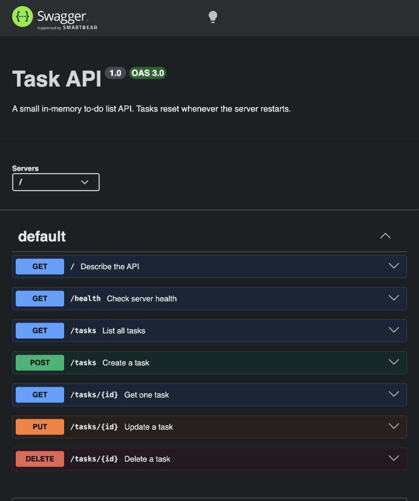

# Task API

A small to-do list REST API built with Node.js, Express, and PostgreSQL. Docker Compose starts the app and database together. [Swagger UI](http://localhost:3000/docs/) lets you send requests from your browser.

## Run the stack

Install and start [Docker Desktop](https://docs.docker.com/desktop/setup/install/mac-install/). From this repository folder, run:

```sh
cp .env.example .env
docker compose up
```

The copy is needed once per clone. Docker Compose builds the app, creates the named `postgres_data` volume, starts PostgreSQL, waits for its health check, and then starts the API at `http://localhost:3000`. Open `http://localhost:3000/docs/` for Swagger UI. Stop with Ctrl+C; use `docker compose down` to remove containers while retaining data. Subsequent starts need only `docker compose up`.

`.env.example` contains local development credentials and a `DATABASE_URL` using the Compose service name `db`. Copy it to `.env` before starting. `.env` is ignored by Git and excluded from the Docker build context. Change the example credentials for any nonlocal deployment.

The first start with a new volume runs [sql/init.sql](sql/init.sql), creating the `tasks` table and three example tasks. The SQL file runs only when PostgreSQL initializes an empty data directory. Deleting every task therefore leaves the database empty on later starts. `docker compose down -v` removes the volume and starts a new database on the next run.

## Endpoints

| Method | Path | Purpose | Success |
| --- | --- | --- | --- |
| GET | `/` | Describe the API | 200 |
| GET | `/health` | Check server health | 200 |
| GET | `/tasks` | List all tasks | 200 |
| GET | `/tasks/:id` | Read one task | 200 |
| POST | `/tasks` | Create a task from `{"title":"Buy milk"}` | 201 |
| PUT | `/tasks/:id` | Update `title`, `done`, or both | 200 |
| DELETE | `/tasks/:id` | Remove a task | 204 |

Missing tasks return 404 with a JSON `error`, such as `{"error":"Task 99 not found"}`. POST needs a nonempty string `title`. PUT needs at least one valid field: a nonempty string `title` and/or a boolean `done`. Invalid bodies return 400 with a JSON `error`. Task responses contain JSON booleans.

For example, on a new volume:

```sh
curl -i -X POST http://localhost:3000/tasks \
  -H 'Content-Type: application/json' \
  -d '{"title":"Buy milk"}'
```

This returns 201 with `{"id":4,"title":"Buy milk","done":false}`. IDs continue increasing as rows are added.

## Repository boundary

`index.js` defines the HTTP routes and calls `taskService.js`. The service owns validation and missing-task errors. `taskRepository.js` implements asynchronous `list`, `get`, `create`, `update`, and `remove` methods with parameterized `pg` queries. PostgreSQL is the only active backend.

The initial A3 extraction changed the routes to call the service and used a SQLite implementation of this repository interface. After that checkpoint passed the HTTP contract, the storage swap changed `taskRepository.js` and dependency/configuration files; `index.js` and `taskService.js` did not change. The earlier SQLite version remains in Git history.

## Persistence check

On a fresh named volume, `GET /tasks` returned the three examples. I created task 4 with POST, updated its title and `done` with PUT, restarted both containers with `docker compose restart db app`, and confirmed `GET /tasks/4` still returned the updated row. I then ran `docker compose down` followed by `docker compose up -d`; `GET /tasks` still returned the original three tasks and task 4, with no duplicate examples. The volume stores the data independently of either container.

To inspect the table directly while the stack is running:

```sh
docker compose exec db psql -U taskapi -d tasks -c 'SELECT id, title, done FROM tasks ORDER BY id;'
```

## Swagger UI



Open `/docs/`, expand an endpoint, click **Try it out**, fill in the body or ID, and click **Execute**. You can create a task, list it, update it, and delete it without a separate API client.

The [A2 SQL exploration notes](docs/sql-exploration.md) and [SQLite viewer screenshot](docs/sqlite-browser.jpg) document the earlier assignment. The running stack now uses PostgreSQL.
