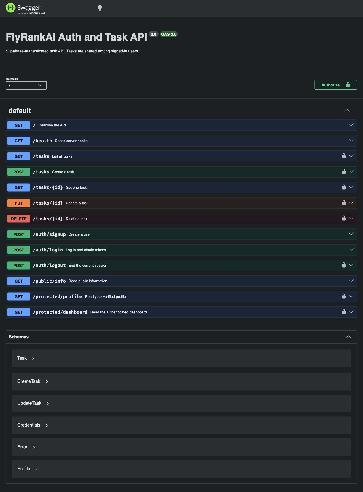

# FlyRankAI Auth and Task API

The Week 5 polite scraper is in [scraper/](scraper/README.md). It runs independently of this API.

A Node.js and Express API with Supabase Auth, PostgreSQL-backed tasks, and interactive Swagger UI. Sign up, log in, pass the returned JWT as a bearer token, and use authenticated routes. Task records are shared among signed-in users; this demo does not assign tasks to individual accounts.

## Run locally

Install [Docker Desktop](https://docs.docker.com/desktop/) and start it. Create a free Supabase project, turn **Confirm email** off for this assignment's immediate signup-to-login exercise, and copy its Project URL and **publishable** API key from the dashboard. From this repository folder:

```sh
cp .env.example .env
```

Replace the two Supabase placeholders in `.env` with your own values:

```dotenv
SUPABASE_URL=https://your-project.supabase.co
SUPABASE_PUBLISHABLE_KEY=sb_publishable_your_project_key
PORT=3000
```

Keep the existing `POSTGRES_*` and `DATABASE_URL` values when using Compose. Run the complete stack with one command:

```sh
docker compose up --build
```

The API is at `http://localhost:3000`; Swagger UI is at `http://localhost:3000/docs/`. Compose creates a persistent PostgreSQL volume and seeds three example tasks on first initialization. `.env` is ignored by Git and excluded from the Docker build context. The API uses only the publishable key; do not add a Supabase secret or service-role key.

For a host-side Node run, use `npm ci && npm start` after providing a reachable `DATABASE_URL` in `.env`. The example `DATABASE_URL` uses the Compose service name `db`, which is not a host address.

## API reference

| Method | Path | Bearer token | Success |
| --- | --- | --- | --- |
| POST | `/auth/signup` | No | 201, `{ "user": ... }` |
| POST | `/auth/login` | No | 200, `access_token` and `refresh_token` |
| POST | `/auth/logout` | Yes | 204, no body |
| GET | `/public/info` | No | 200, public message |
| GET | `/protected/profile` | Yes | 200, user ID, email, creation time |
| GET | `/protected/dashboard` | Yes | 200, dashboard greeting and user ID |
| GET | `/tasks` | Yes | 200, all tasks |
| GET | `/tasks/:id` | Yes | 200, one task |
| POST | `/tasks` | Yes | 201, new task |
| PUT | `/tasks/:id` | Yes | 200, updated task |
| DELETE | `/tasks/:id` | Yes | 204, no body |

`/`, `/health`, and `/docs/` are also public. Signup and login accept JSON with nonempty `email` and `password`. Missing fields return 400; bad login credentials return 401. Protected routes return 401 for a missing, malformed, invalid, or expired bearer token. Task validation errors return 400; missing task IDs return 404. Supabase Auth failures return 502 when the upstream service is unavailable.

### Try the auth flow

```sh
curl -i -X POST http://localhost:3000/auth/signup \
  -H 'Content-Type: application/json' \
  -d '{"email":"you@example.com","password":"a-strong-test-password"}'

curl -i -X POST http://localhost:3000/auth/login \
  -H 'Content-Type: application/json' \
  -d '{"email":"you@example.com","password":"a-strong-test-password"}'
```

Copy `access_token` from the login response. Use it as follows:

```sh
curl -i http://localhost:3000/protected/profile \
  -H 'Authorization: Bearer YOUR_ACCESS_TOKEN'

curl -i http://localhost:3000/tasks \
  -H 'Authorization: Bearer YOUR_ACCESS_TOKEN'

curl -i -X POST http://localhost:3000/auth/logout \
  -H 'Authorization: Bearer YOUR_ACCESS_TOKEN'
```

Logout revokes the current session's **refresh token** through Supabase Auth. Supabase does not erase the cryptographic validity of an already issued JWT, but this API calls `getUser(token)` on each protected request; in the live logout check, Supabase rejected the logged-out token immediately with 401. Clients should still discard both tokens. Another service that only checks the JWT signature may accept it until expiry, so use a short JWT lifetime where that matters. The server does not store session tokens or log credentials.

## Swagger UI



Open `/docs/`, click **Authorize**, and paste the login `access_token`. Swagger sends `Authorization: Bearer <token>` for the locked routes. Click **Try it out** on `/protected/profile` to see your verified profile. The endpoint definitions live in [openapi.json](openapi.json).

## Implementation notes

`index.js` defines routes and reusable auth middleware. The middleware extracts the bearer token and verifies it with Supabase `auth.getUser(token)` before exposing a user to protected handlers. `supabaseClient.js` creates clients without persistent sessions or automatic token refresh, so one request's session cannot be reused by another. PostgreSQL task access remains in `taskService.js` and `taskRepository.js`; the middleware guards the whole `/tasks` path before those handlers run.

Stop containers with Ctrl+C. `docker compose down` removes containers but retains tasks in the named volume. `docker compose down -v` also removes that volume. The [earlier SQL exploration notes](docs/sql-exploration.md) and [SQLite viewer screenshot](docs/sqlite-browser.jpg) document the prior assignment; the running API uses PostgreSQL.
