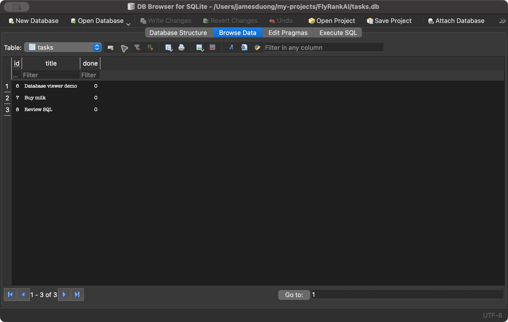

# Task API

A small to-do list REST API built with Node.js, Express, and SQLite. Tasks survive server restarts, and [Swagger UI](http://localhost:3000/docs/) lets you send requests from your browser.

## Run locally

Install Node.js 22 or newer, then run these commands in the repository folder:

```sh
npm ci
npm start
```

The server starts at `http://localhost:3000`. Open `http://localhost:3000/docs/` for Swagger UI. Stop the server with Ctrl+C. `npm ci` installs the versions in `package-lock.json`; `npm start` is the command that runs the server. On its first start, the app creates `tasks.db` and the `tasks` table automatically.

## Endpoints

| Method | Path | Purpose | Success |
| --- | --- | --- | --- |
| GET | `/` | Describe the API | 200 |
| GET | `/health` | Check server health | 200 |
| GET | `/tasks` | List all tasks | 200 |
| GET | `/tasks/:id` | Read one task | 200 |
| POST | `/tasks` | Create a task from `{"title":"Buy milk"}` | 201 |
| PUT | `/tasks/:id` | Update `title`, `done`, or both | 200 |
| DELETE | `/tasks/:id` | Remove a task | 204 |

Missing tasks return 404 with a JSON `error`. POST needs a nonempty string `title`. PUT needs at least one valid field: a nonempty string `title` and/or a boolean `done`. Invalid bodies return 400 with a JSON `error`.

Example request and response from `curl -i`:

```text
$ curl -i -X POST http://localhost:3000/tasks -H 'Content-Type: application/json' -d '{"title":"Buy milk"}'
HTTP/1.1 201 Created
X-Powered-By: Express
Content-Type: application/json; charset=utf-8
Content-Length: 40

{"id":4,"title":"Buy milk","done":false}
```

## Swagger UI


Open `/docs/`, expand an endpoint, click **Try it out**, fill in the body or ID, and click **Execute**. You can create a task, list it, update it, and delete it without a separate API client.

## Data lifetime

SQLite stores tasks in `tasks.db` beside `index.js` in this repository folder. SQLite was chosen because it persists data in one local file and needs no separate database server. The file is ignored by Git, so each clone creates its own database.

The app inserts three example tasks when it first creates the table. Later restarts keep your changes. If you delete every task, the table stays empty after a restart.

To inspect the database with a SQLite viewer, open `tasks.db`. For example, I ran `SELECT COUNT(*) FROM tasks;` in DB Browser for SQLite; it returned `3` for three local demo tasks. [The SQL exploration notes](docs/sql-exploration.md) record the other queries and their effect on the API.


