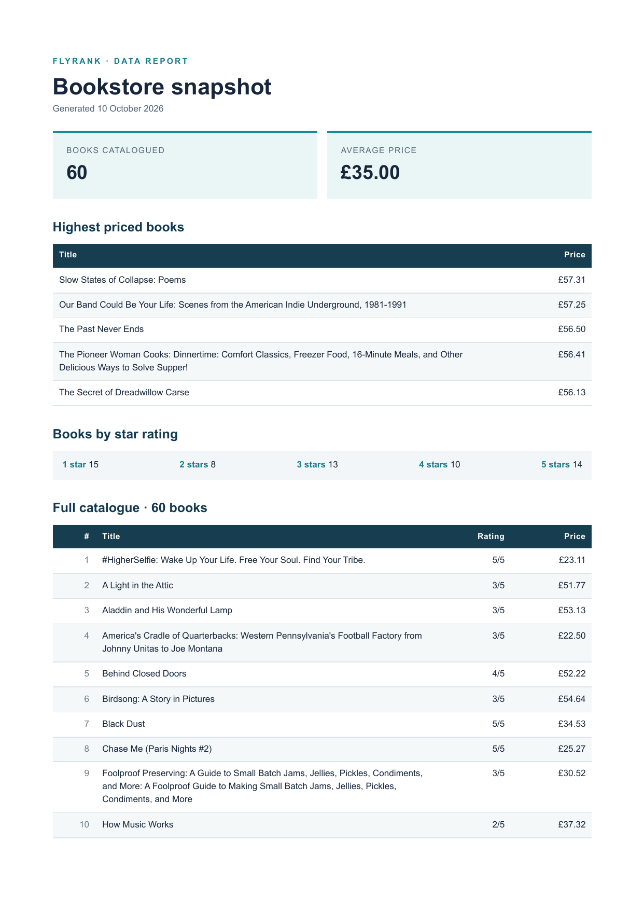

# PDF report generator

A standalone JavaScript/Express report pipeline for the 60 validated books in [`../scraper/output/books.json`](../scraper/output/books.json). A SQLite query summarizes the catalogue, Playwright prints an HTML report to a three-page A4 PDF, and the API stores the file on disk and serves it by link. This is the required Week 4 A8 work through Stage 6; the optional AI rematch is excluded.

## Run locally

Use Node.js 22 or newer. From this folder:

```sh
npm ci
npx playwright install chromium
npm run seed
npm run seed             # still 60 books
npm run inspect          # prints the complete report data as JSON
npm run render           # creates reports/test.pdf
npm start                # http://localhost:3000
```

`report.db` and `reports/` are generated locally and ignored by Git. The committed book JSON is the seed recipe's input; no Supabase account, external database, or live scraper run is needed. If port 3000 is occupied, set `PORT` before `npm start` and use that port in the URLs below.

## Report data and SQL

The seed maps `price_gbp` to numeric GBP and `rating_text` to a 1–5 integer. `getReportData()` runs these queries against SQLite:

```sql
SELECT COUNT(*) AS book_count, AVG(price) AS average_price FROM books;

SELECT title, price, rating
FROM books
ORDER BY price DESC, title ASC
LIMIT 5;

SELECT rating, COUNT(*) AS book_count
FROM books
GROUP BY rating
ORDER BY rating;

SELECT title, price, rating, url
FROM books
ORDER BY title COLLATE NOCASE, id;
```

For the committed 60-book dataset, the count is 60, the average price rounds to £35.00, and rating counts are 15, 8, 13, 10, and 14 for one through five stars. The full catalogue query feeds the long PDF table. Its `<thead>` repeats on each page, and print CSS keeps rows together.

## Generate and download

With the server running:

```sh
curl -i -X POST http://localhost:3000/reports
curl -i http://localhost:3000/reports/REPORT_ID
curl -o my-report.pdf http://localhost:3000/reports/REPORT_ID/file
```

The first `POST` of the server's local calendar day returns `201` with an ID and file link; a later `POST` returns `200` with the same values. `GET /reports/:id` returns its `id`, stored `path`, `created_at`, and file link. Unknown IDs return `404` for both lookup and download. The file endpoint sends PDF bytes; the JSON endpoints send only metadata.

A local curl run returned the following generation response, and downloading its link produced a three-page PDF:

```text
HTTP/1.1 201 Created
{"id":"38182568-91a8-4f4c-ae87-33fea60bb85d","file":"/reports/38182568-91a8-4f4c-ae87-33fea60bb85d/file"}
my-report.pdf: PDF document, version 1.4, 3 pages
```



## Duplicate requests and the request wait

Two rapid `POST /reports` requests without a body return the same ID: one gets `201`, the other `200`, and only one new PDF is written. To request a fresh copy anyway, use:

```sh
curl -i -X POST http://localhost:3000/reports \
  -H 'Content-Type: application/json' -d '{"force":true}'
```

The daily lookup and in-flight request guard protect against double clicks creating duplicate reports. Without this kind of check, a repeated invoice or paid email delivery could charge or contact a customer twice.

I would move PDF generation out of the request once the report takes more than a few seconds under normal load or several people generate reports concurrently; at that point the visible wait and held-open requests become a reliability problem.

## Verify

```sh
npm test
```

The end-to-end test reseeds twice, fires two simultaneous requests, checks that they share one ID and one report row/file, downloads and checks the PDF signature, verifies unknown IDs, and confirms `{ "force": true }` creates a second report. The three-page PDF was also rendered to images and visually checked for complete rows and repeated catalogue headers.
